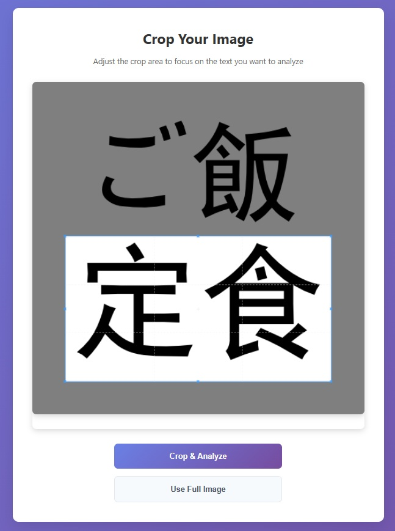
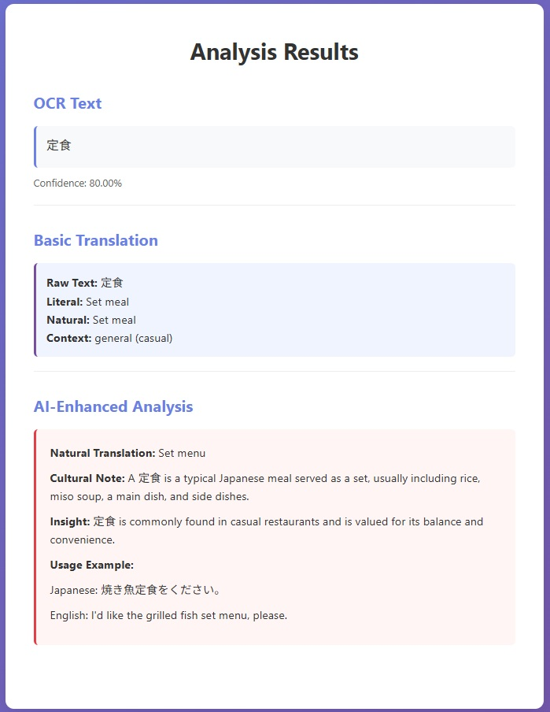

# JPLens Master Application

A web application that integrates **[JPLensContext](https://github.com/AndreMinHo/JPLensContext)** and **[JPLensAIContext](https://github.com/AndreMinHo/JPLensAIContext)** APIs to analyze Japanese text from images.

## Overview

This application provides a user-friendly web interface to:
1. Upload images containing Japanese text
2. Extract text using OCR (JPLensContext API)
3. Provide AI-enhanced analysis and cultural insights (JPLensAIContext API)





## Architecture

```
User Uploads Image
        ↓
JPLens Master App 
    - Image Cropping and Optimization
        ↓
JPLensContext API
    - OCR + Basic Translation
        ↓
JPLensAIContext API
    - AI-Enhanced Analysis
        ↓
Combined Results Displayed
```


## Prerequisites

- Node.js 16+
- Running instances of:
  - **[JPLensContext API](https://github.com/AndreMinHo/JPLensContext)**
  - **[JPLensAIContext API](https://github.com/AndreMinHo/JPLensAIContext)**


## Installation

```bash
npm install
```

## Usage

### Local Development 

1. **Start the APIs:**
   - Start JPLensContext (http://localhost:8000)
   - Start JPLensAIContext (http://localhost:8001)

2. **Start JPLens:**
   ```bash
   npm run dev  # For development with hot reloading
   # OR
   npm start    # For production mode
   ```

3. **Open your browser:**
   - Navigate to http://localhost:3000
   - Upload an image with Japanese text
   - View the OCR results and AI analysis

### Cloud Deployment (Railway)

1. **Deploy APIs to Railway:**
   - Create Railway account at https://railway.app
   - Deploy JPLensContext: Connect `../JPLensContext` repo to Railway project
   - Deploy JPLensAIContext: Connect `../JPLensAIContext` repo to Railway project
   - Deploy JPLens Master: Connect this repo to Railway project

2. **Configure Environment Variables:**
   
   **Option A: Internal URLs (Recommended for Better Performance)**
   
   If all services are in the same Railway project, use internal networking:
   ```
   JPLENS_CONTEXT_URL=http://<JPLENS_CONTEXT_INTERNAL_URL>:PORT
   JPLENS_AI_CONTEXT_URL=http://<JPLENS_AI_CONTEXT_INTERNAL_URL>:PORT
   ```
   
   **Option B: Public URLs**

   ```
   JPLENS_CONTEXT_URL=https://<your-jplens-context-public-url>
   JPLENS_AI_CONTEXT_URL=https://<your-jplens-ai-context-public-url>
   ```

3. **Deployment Notes:**
   - Railway will automatically detect and use railwaypack (via NIXPACKS) for Node.js deployment
   - The `railway.json` configuration ensures proper health checks and restart policies


## API Integration

The app chains two API calls:
- `POST /translate-image` to JPLensContext for OCR and basic translation
- `POST /analyze/simple` to JPLensAIContext for enhanced AI analysis


## Authentication

The application supports optional password authentication. Authentication is **only active when the `APP_PASSWORD` environment variable is set**.

- When `APP_PASSWORD` is not set: No authentication required
- When `APP_PASSWORD` is set: Users will be prompted to enter credentials
  - **Username**: `admin` (fixed)
  - **Password**: Value of the `APP_PASSWORD` environment variable

### Setting the Password

**For Railway Deployment (to enable authentication):**
1. Go to your Railway project dashboard
2. Click on "Variables" in the project settings
3. Add a new variable: `APP_PASSWORD` with your desired password value
4. Redeploy the application to apply the changes

**For Local Development (optional):**
Add `APP_PASSWORD=your_password_here` to your `.env` file if you want to test authentication locally.

**Note**: The `/health` endpoint remains publicly accessible for monitoring purposes without authentication.

## Development

- **Backend**: Node.js + Express
- **Frontend**: Vanilla HTML/CSS/JavaScript
- **File Upload**: Multer middleware
- **API Client**: Axios for HTTP requests
